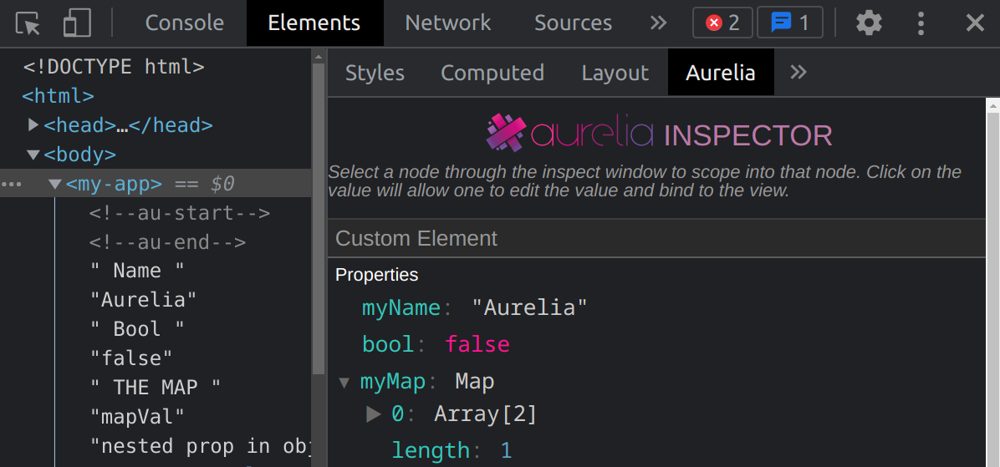

# Aurelia Inspector
Aurelia Chrome Inspector, that supports both Aurelia v1 and v2.

## Limitations
- Map and Set changes don't live update
- V1 and V2 not on the same feature level

## Development

### Loading the extension into Chrome
Follow https://developer.chrome.com/docs/extensions/mv3/getstarted/#manifest (skip the creation `manifest.json` part)

### Developing
1. Run `npm run start`
2. Pin the Aurelia Extension in the toolbar
   1. Verify the Extension picked up your Aurelia page: "Aurelia 2 detected on this page."
   2. If you encounter an Error (like, "File not found") please
      1. Right click in that panel/pop-up
      2. Inspect
      3. Find clues on why the issue arose
3. Open the Developer Tools
   1. Navigate to "Elements" and where tabs like "Style" and "Layout" are at the end, you can find "Aurelia"
4. For changes, you have to reload the extension every time. There is a refresh icon in `chrome://extensions` for the Aurelia card
   1. If an `Error` pops up (in that same card), you can click on it, and then clear
5. Furthermore, you have to reload the Developer tools
   1. Close and reopen
   2. Or `inspect` and Ctrl+R in the inspect window
6. You may to reload the page itself again for the "Aurelia" tab to reappear

### Submitting PR
Make sure to commit the files in `/dist` as well.
